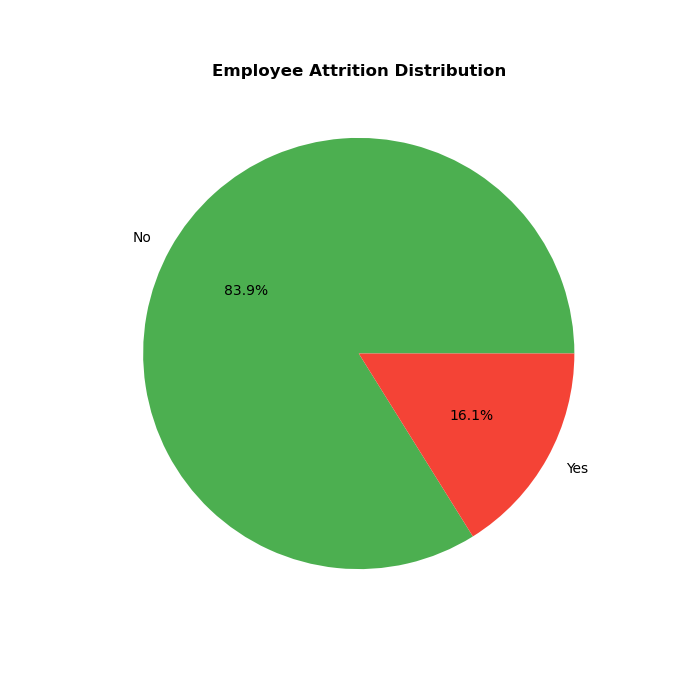
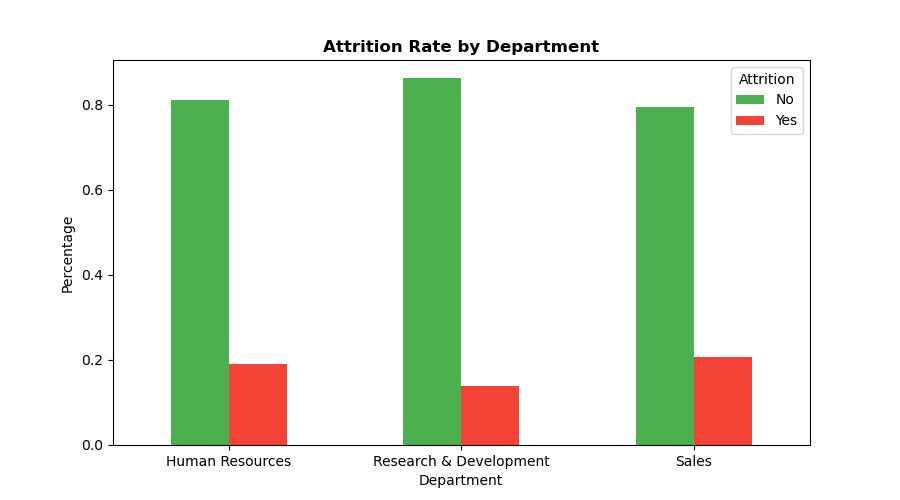
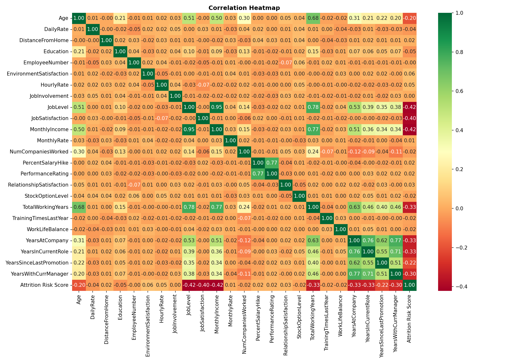

# 👥 HR Workforce Attrition Analytics
### Python • MySQL • Power BI • Statistical Analysis

---

## 📌 Problem Statement
A company with 1,470 employees was experiencing high attrition
with no visibility into which departments, job roles and salary
bands were most at risk — this project identifies key attrition
drivers and delivers actionable HR recommendations.

---

## 🛠️ Tools Used
| Tool | Purpose |
|---|---|
| Python (Pandas, Seaborn, Scipy) | Data Cleaning, EDA & Statistical Analysis |
| MySQL | Advanced SQL Queries |
| Power BI | Interactive HR Dashboard |

---

## 📁 Project Structure
hr-workforce-attrition-analytics/

├── data/

│   ├── hr_attrition.csv

│   └── hr_cleaned.csv

├── notebooks/

│   ├── 01_data_cleaning.ipynb

│   ├── 02_eda_analysis.ipynb

│   └── 03_statistical_analysis.ipynb

├── sql/

│   └── hr_analysis.sql

├── dashboard/

│   └── hr_dashboard.pbix

├── outputs/

│   ├── 02_attrition_distribution.png

│   ├── 02_attrition_by_dept.png

│   ├── 02_attrition_by_role.png

│   ├── 03_correlation_heatmap.png

│   └── 03_risk_score_validation.png

└── README.md

---

## 📊 Key Business Insights
1. 237 employees left out of 1,470 — 16.12% attrition rate
2. Laboratory Technicians have highest attrition at 62 employees
3. Sales Executives are second highest attrition role at 57 employees
4. 74.5% of attrition comes from overtime employees
5. Employees who left earned avg $4.79K vs $6.83K for those who stayed
6. $2.04K salary gap between who left and who stayed
7. Research & Development loses most employees at 130+ 
8. Employees leave before completing 6 years avg tenure of 5.13 years
9. Sales Representatives earn lowest salary among all job roles
10. 26-35 age band dominates workforce at 600+ employees

---

## 📈 Dashboard Preview




---

## 🚀 How to Run

1. Clone the repo
```bash
git clone https://github.com/surajsalokhe19/hr-workforce-attrition-analytics.git
```

2. Install libraries
```bash
pip install pandas matplotlib seaborn scipy
```

3. Run notebooks in order
01_data_cleaning.ipynb

02_eda_analysis.ipynb

03_statistical_analysis.ipynb

4. Open dashboard
dashboard/hr_dashboard.pbix

---

## 💡 Business Recommendations
1. Reduce overtime immediately — 74.5% attrition linked to overtime
2. Increase Lab Technician salary by 15-20% — highest attrition role
3. Restructure Sales Rep pay — lowest salary highest attrition
4. Salary review for all employees earning below $5K monthly
5. Launch 5 Year Loyalty Bonus to retain employees at critical point
6. Career growth program for R&D — largest department losing 130+ employees
7. Dedicated career path for Sales Executives — second highest attrition
8. Targeted hiring to close 60-40 gender gap